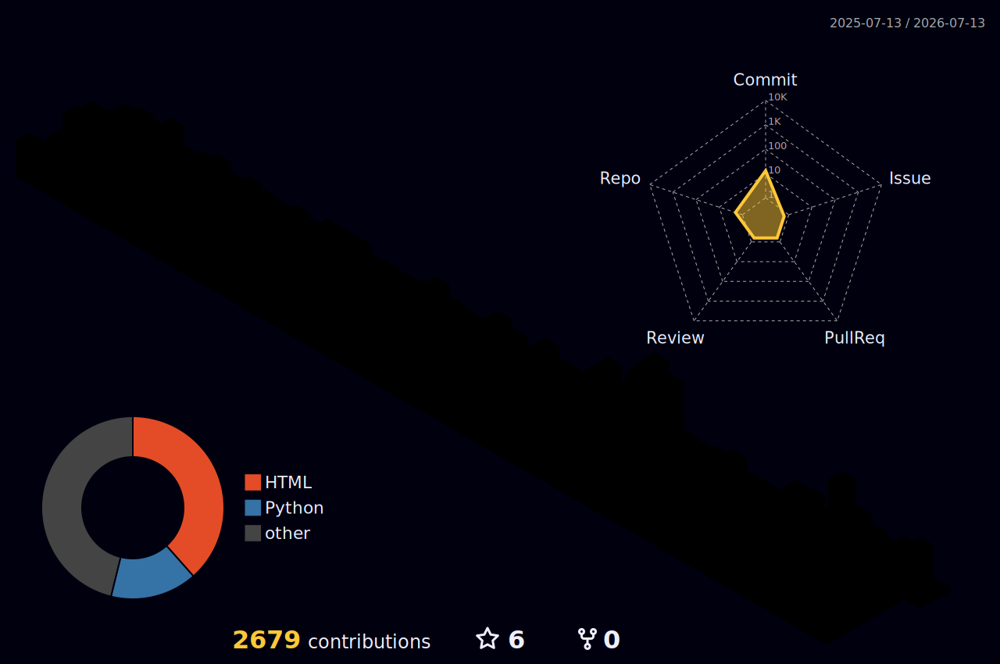

| | | |
|---|---|---|
| **Habimon** | Tamagotchi-style habit tracker with a retro pixel pet |   |
| **TrayGo** | Simple inventory management for small teams |   |
| **BallRoyale** | Last ball standing wins — **[Play now →](https://ballroyale.pages.dev/)** |  |

